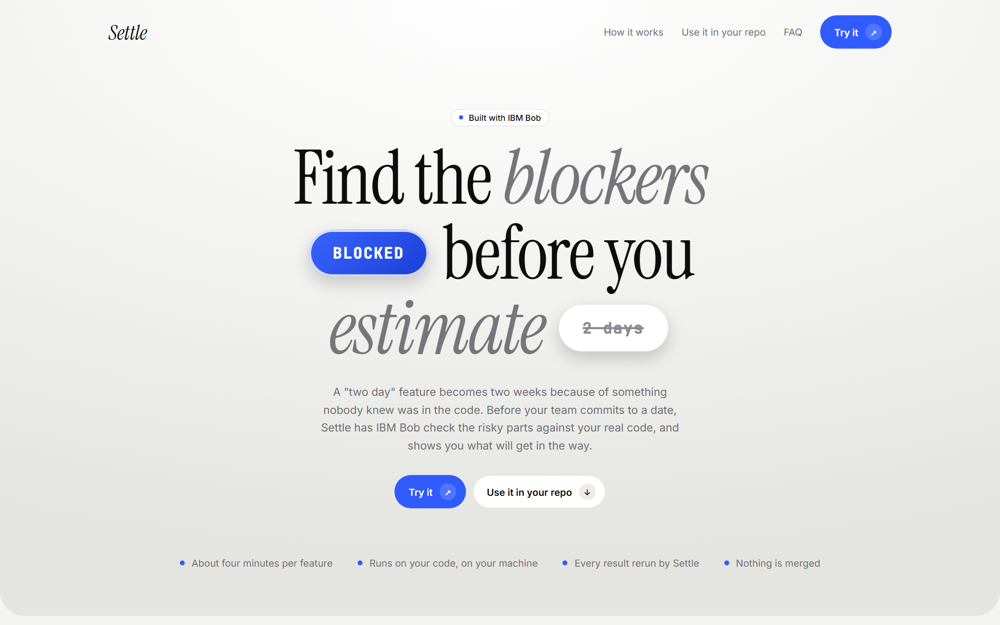
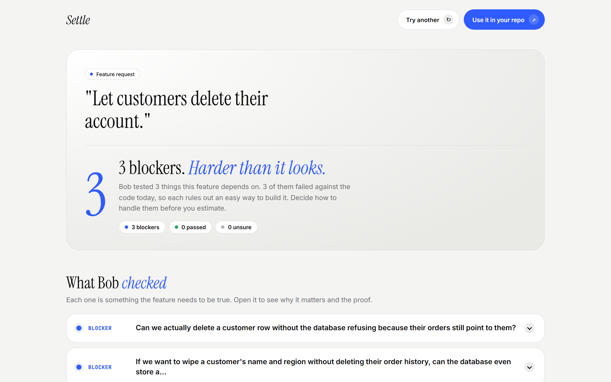

<p align="center">
  
</p>

<h1 align="center">Settle</h1>

<p align="center">
  <b>Find the blockers before you estimate.</b><br>
  Before your team commits to a date, IBM Bob tests what a feature depends on against your real code, and Settle reruns every test.
</p>

<p align="center">
  <a href="https://settle-blush.vercel.app"></a>
  <a href="https://settle-blush.vercel.app/try/"></a>
  <a href="https://github.com/jenzylove/settle/actions/workflows/test.yml"></a>
  <a href="https://lablab.ai/ai-hackathons/ibm-bob-2-hackathon"></a>
  <a href="LICENSE"></a>
</p>

<p align="center">
  
</p>

| Start here | |
| --- | --- |
| Live site | https://settle-blush.vercel.app |
| Try it (real recorded runs, replayed) | https://settle-blush.vercel.app/try/ |
| A full results page | https://settle-blush.vercel.app/runs/prove-2026-09-27T12-51-10/ |
| Use it in Bob IDE | the **Settle Prove** mode in [.bob/custom_modes.yaml](.bob/custom_modes.yaml) |
| Bob IDE task evidence | [bob_sessions/](bob_sessions/) |
| Submission copy | [docs/SUBMISSION.md](docs/SUBMISSION.md) |

A "two day" feature turns into two weeks because of something nobody knew was in the code. Engineers estimate by reading the repo; the surprises only show up once someone builds it.

Settle moves the surprises to the start. You give it one sentence, the feature you are about to estimate:

1. **Bob finds the risks.** IBM Bob reads the code the feature would touch and names the assumptions it silently depends on, the ones that cost days if they are wrong.
2. **Bob runs experiments.** One Bob Shell session per assumption, all at once, each in its own git worktree, writes the smallest test that proves or disproves that assumption against today's code.
3. **Settle checks the work.** Settle reruns every experiment itself instead of trusting Bob's word: a passing experiment is marked **test passed**, a failing one is **blocked** (with the exact error or wrong value), anything that could not run or touched existing files is **unknown**.
4. **Bob writes the plan** from what was actually found: what we now know, the blockers to fix first, the build order, and how the findings change the estimate.

Nothing is merged. Every experiment stays on its own branch.

<p align="center"></p>

## Why not just ask an AI

An AI can guess what might go wrong. Settle shows you, with a failing test against your real code, and it does not take the builder's word for it: every experiment is rerun independently, and experiments may only add files: one that changes any existing file is not trusted.

## Use it

**In IBM Bob IDE:** open your repo, switch to the **Settle Prove** mode (`.bob/custom_modes.yaml`), and describe the feature. The mode writes `prove.yml`, asks before spending Bobcoins, runs the proof on your code and reports the blockers in plain words. It can only write `prove.yml`.

**From the terminal:**

Requirements: Node 24, git, and [IBM Bob Shell](https://bob.ibm.com/docs/shell/getting-started/install-and-setup) with a `BOB_API_KEY` (Inference scope).

```bash
npm install
cd demo/orders-api && npm install
node ../../bin/settle.mjs prove        # reads prove.yml
```

`prove.yml`:

```yaml
request: Let customers delete their account.
context: Customers want a "delete my account" button.
experiment:
  command: node --import tsx --test {file}
assumptions: 3
```

Each proof writes `runs/prove-<time>/proof.json`, `index.html` (the evidence board), `events.jsonl` and one log per Bob session.

## How it works

| Part | File |
|---|---|
| The prove pipeline: plan, parallel experiments, independent rerun, plan | [src/prove.ts](src/prove.ts) |
| Evidence board page | [src/proof-page.ts](src/proof-page.ts) |
| Landing page | [src/app/landing-prove.ts](src/app/landing-prove.ts) |
| Bob Shell runner (headless, parallel, streams tool calls) | [src/bob.ts](src/bob.ts) |
| Worktrees, commits, test file detection | [src/git.ts](src/git.ts) |
| Process control with time limits | [src/measure.ts](src/measure.ts) |
| Command line | [src/cli.ts](src/cli.ts) |

Settle also includes `settle run`, which builds competing designs for the same change and measures them with one load test (the engine `settle prove` grew out of). Its results are at [/compare/](https://settle-blush.vercel.app/compare/).

## How IBM Bob is used

- **Inside the product:** Bob Shell names the risky assumptions, builds every experiment in parallel (one headless session per assumption, each in its own worktree), and writes the final plan. Session logs and costs are saved with each proof.
- **Building Settle:** Bob IDE tasks wrote test suites and CI, the Settle custom mode, and two reviews of the harness and verdict that found and fixed six real bugs. Session summaries are in [bob_sessions/](bob_sessions/).

## Tests

`npm test` runs 73 tests, including end to end runs of `settle prove` (proven, blocked, and an experiment that edits an existing file being distrusted even though Bob claimed it held) and of the comparison pipeline, both on a fixture app with a stand in for Bob Shell. GitHub Actions runs typecheck and tests on every push.

## Good to know

- **It checks, it does not build.** Settle tests what a feature depends on in today's code. Writing the feature is still your team's job, now with the blockers known up front.
- **Every result can be checked.** Each finding shows the test Bob wrote and Settle's rerun output, so a badly written test is easy to spot rather than silently trusted. Tests that never touch your app or change existing files are marked unsure.
- **Bob picks what to check.** The results page lists exactly what was tested, so the team can add anything Bob missed.
- **It runs next to your code.** Locally, in Bob IDE or in CI, with your Bob. There is no hosted service that takes your repository.

Built for the IBM Bob 2.0 Hackathon. MIT license.
